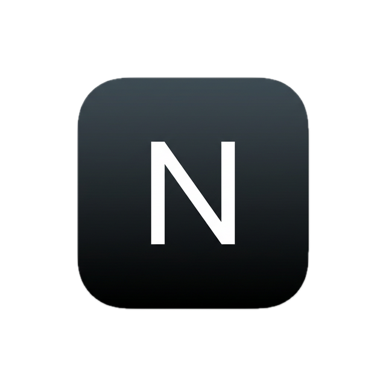

# NanoBrowse

<div align="center">
  
  
  <p><strong>The minimal, fast, and intelligent agentic browser.</strong></p>

</div>

---

**NanoBrowse** is a modern, beautifully designed web browser powered by advanced AI. Featuring a sleek, minimalist UI with glassmorphic aesthetics, it feels deeply native on your OS. The integrated AI sidebar doesn't just chat—it can autonomously navigate, read pages, fill forms, click buttons, and execute multi-step web workflows on your behalf.

## Features

- ✨ **Sleek Minimalist Aesthetic**: A polished dark theme with native glassmorphism and subtle animations.
- 🤖 **Agentic Capabilities**: The AI can take actions in your browser—scrolling, clicking, and extracting information.
- ⚡ **Lightweight & Fast**: Built with Electron, React, and Vite for snappy performance.
- 🧠 **Context-Aware Sidebar**: The AI knows exactly what page you are on and can interact with its content.

## Installation

### From Releases
Download the latest application for your OS (macOS `.dmg`, Windows `.exe`, or Linux `.AppImage`) from our [Releases page](https://github.com/hereisSwapnil/NanoBrowse/releases).

### Local Development

1. **Clone the repository:**
   ```bash
   git clone https://github.com/hereisSwapnil/NanoBrowse.git
   cd NanoBrowse
   ```

2. **Install Dependencies:**
   ```bash
   npm install
   ```

3. **Start Development Environment:**
   Run the Vite renderer and the Electron app concurrently.
   ```bash
   npm run dev
   ```

## Configuration
NanoBrowse requires an OpenAI API key to power its agentic features.
1. Open the application.
2. Click the **Settings (Gear) icon** in the top right.
3. Add your `OpenAI API Key` securely.

## Building for Production
You can create production executables for your specific operating system using the following commands:

- macOS (`.dmg`): `npm run build:mac`
- Windows (`.exe`): `npm run build:win`
- Linux (`.AppImage`): `npm run build:linux`

To build for all supported platforms at once:
```bash
npm run build
```
The compiled binaries will be available in the `dist` directory.

## Contributing
Contributions are welcome! If you have suggestions or bug reports, please open an issue.

## License
MIT License.
